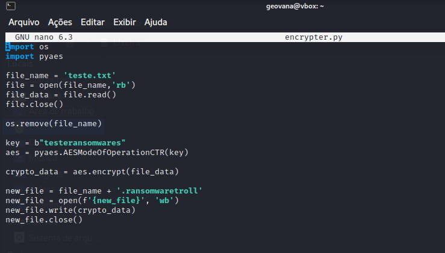
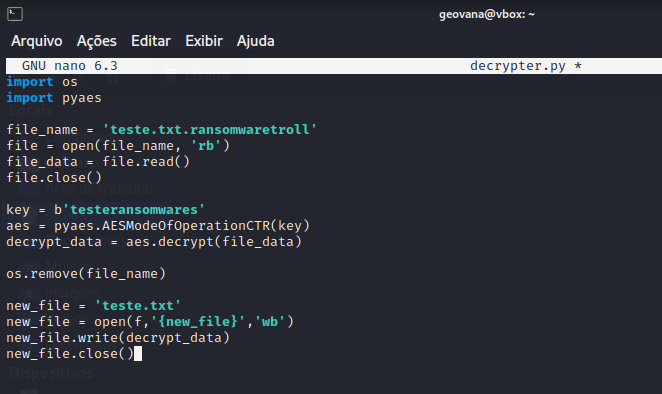

# desafio_ransomware

### Descrição
Nesse desafio, foi proposto a implementação de um Ransomware para criptografar arquivos utilizando a linguagem Python.

### Código encrypter

### Código decrypter

